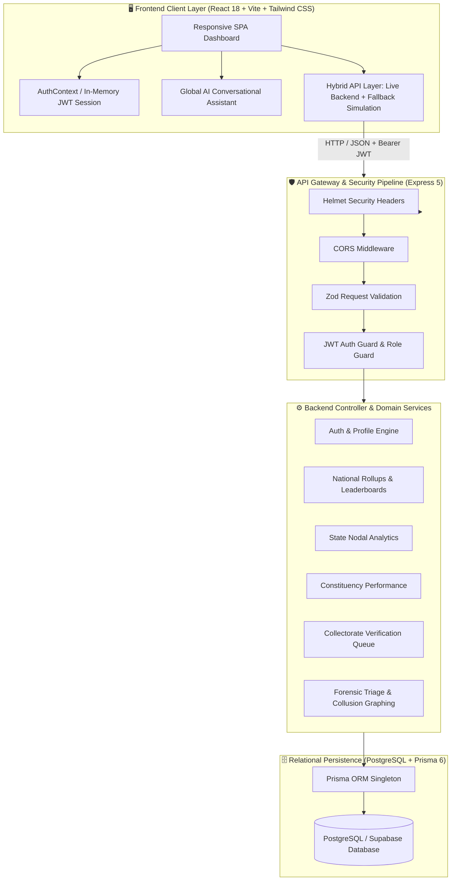
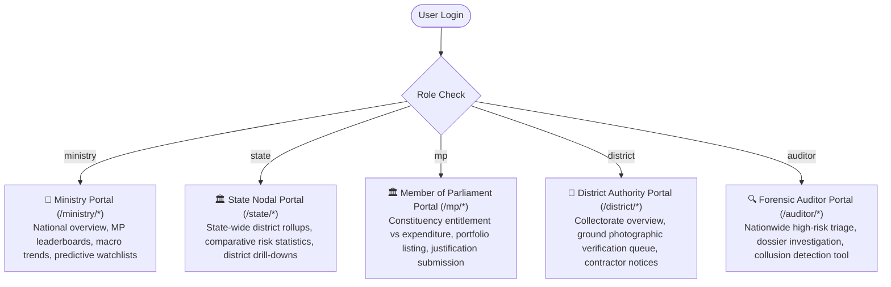

# 🇮🇳 MPLADS SENTINEL — AI-Powered Anomaly & Early Warning Governance Engine

### Smart India Hackathon 2026 • Ministry of Statistics and Programme Implementation (MoSPI)
> **Automated early-warning anomaly detection, forensic audit triage, contractor collusion graphing, and photographic ground asset verification across 38,000+ MPLADS projects nationwide.**

---

## 📑 Quick Navigation
- [System Architecture & Overview](#-system-architecture--overview)
- [Repository Structure](#-repository-structure)
- [Key Innovations & Technical Differentiators](#-key-innovations--technical-differentiators)
- [Role-Based Access Control (RBAC) & Portals](#-role-based-access-control-rbac--portals)
- [Official Demo Credentials](#-official-demo-credentials)
- [Quick Start Guide (Full-Stack Setup)](#-quick-start-guide-full-stack-setup)
- [Subsystem Documentation Links](#-subsystem-documentation-links)

---

## 🌐 System Architecture & Overview

The **Member of Parliament Local Area Development Scheme (MPLADS)** entitles each MP to recommend developmental projects with an annual allocation of ₹5 Crore per constituency. Operating at this scale across hundreds of constituencies, thousands of implementing agencies, and tens of thousands of contractors introduces severe governance and surveillance bottlenecks:
- **Tender Inflation**: Works bid significantly higher than state schedules of rates (SoR).
- **Milestone Slippage**: Projects stalled indefinitely without timely administrative escalation.
- **Contractor Collusion & Syndicates**: Repeat vendor cartels and same-day tender splitting below statutory competitive bidding thresholds.
- **Ghost Assets**: Funds disbursed on paper for projects lacking geotagged physical asset verification.

**MPLADS SENTINEL** transforms raw administrative registers into proactive, explainable intelligence through a high-performance **React Single-Page Application (SPA)** frontend coupled with a scalable **Express 5 + Prisma ORM + PostgreSQL** backend data engine.



---

## 📂 Repository Structure

This repository is organized as an enterprise full-stack monorepo:

```
SIH 2026/
├── README.md                     # 📖 Master project overview (this file)
│
├── backend/                      # ⚙️ Express 5 + Prisma 6 REST API Engine
│   ├── README.md                 # 📘 In-depth Backend Architecture & Complete API Docs
│   ├── package.json              # Backend dependencies and scripts
│   ├── .env.example              # Sample environment configuration
│   ├── prisma/                   # Database schema, migrations & models
│   │   ├── schema.prisma         # Main Prisma configuration
│   │   ├── migrations/           # Versioned SQL migration scripts
│   │   └── models/               # Multi-file schema folder (14 distinct domain models)
│   └── src/                      # Source code (controllers, routes, services, middleware)
│
└── frontend/                     # 🛡️ React 18 + Vite + Tailwind CSS Dashboard
    ├── README.md                 # 📗 In-depth Frontend Architecture & Component Specs
    ├── package.json              # Frontend dependencies and scripts
    ├── vite.config.js            # Vite bundler configuration
    ├── tailwind.config.js        # Design tokens, color palette, typography
    ├── vercel.json               # SPA routing rules for production deployment
    ├── .env                      # Local environment configuration (VITE_API_URL)
    └── src/                      # UI components, pages, context, and hybrid API layer
```

---

## 🚀 Key Innovations & Technical Differentiators

| Innovation | Module | Description |
| :--- | :--- | :--- |
| **Multi-Factor AI Risk Scoring** | `/ministry/overview`<br>`/cases/:workId` | Normalized risk score ($0-100$) weighted across Cost Inflation ($W_1$), Milestone Delay Slippage ($W_2$), Spatial/GIS Proximity Duplication ($W_3$), and Contractor Concentration ($W_4$). Fully explainable via visual breakdown cards. |
| **Contractor Collusion & Shell Detection** | `/auditor/vendor` | Algorithmic cross-referencing of vendor contracts across states and districts. Identifies **same-day tender splitting** just below the ₹10 Lakh statutory competitive threshold, round-figure billing patterns, and shared entity networks. |
| **Predictive Risk Watchlist (30-Day Slippage)** | `/ministry/predictions` | Machine-learning trend modeling identifying currently "Medium/Low" projects with high *Risk Velocity* ($\Delta R / \Delta t$) predicted to breach critical overrun thresholds in the next 30 days. |
| **Geotagged Photographic Verification Queue** | `/district/verification` | Eliminates ghost infrastructure by blocking final fund release for completed works until ground photos with verified GPS coordinates are audited by district authorities. |
| **Official Workflow Actions & Audits** | `/auditor/case/:workId`<br>`/cases/:workId` | Integrated governance workflows allowing authorities to issue audit notices, record formal MP justifications, request physical inspections, or record final auditor resolutions. |
| **Role-Aware AI Conversational Assistant** | `ChatbotWidget` | Embedded floating assistant aware of the logged-in user's role and constituency, capable of answering queries regarding scheme guidelines, anomaly flags, and expenditure. |

---

## 👥 Role-Based Access Control (RBAC) & Portals

The application implements zero-trust role-based access control across **5 distinct administrative tiers**:



---

## 🔑 Official Demo Credentials

For live hackathon evaluations, presentations, and automated testing, the database and frontend quick-login bar provide pre-configured role identities:

| Tier | Role Label | Email | Password | Default Portal Route |
| :--- | :--- | :--- | :--- | :--- |
| **1. National Ministry** | MoSPI Ministry Admin | `ministry@mplads.gov.in` | `ministry@mplads123` | [`/ministry/overview`](file:///frontend/README.md#-ministry-oversight-portal-national-view) |
| **2. State Nodal Authority** | Bihar State Nodal Officer | `bihar@mplads.gov.in` | `bihar@mplads123` | [`/state/overview`](file:///frontend/README.md#-state-nodal-authority-portal) |
| **3. Member of Parliament** | Abhay Kumar Sinha (MP, Aurangabad) | `abhaykumarsinha@mplads.gov.in` | `abhaykumarsinha@mplads123` | [`/mp/overview`](file:///frontend/README.md#-member-of-parliament-mp-portal) |
| **4. District Authority** | Aurangabad District Collectorate | `aurangabad@mplads.gov.in` | `aurangabad@mplads123` | [`/district/overview`](file:///frontend/README.md#-district-authority-portal-dno--collectorate) |
| **5. Forensic Auditor** | Independent Forensic Investigator | `auditor@mplads.gov.in` | `auditor@mplads123` | [`/auditor/queue`](file:///frontend/README.md#-independent-forensic-auditor-portal) |

> 💡 **Quick Demo Feature:** The login page features **1-Click Quick Demo Login** buttons for instant role switching without typing credentials.

---

## ⚡ Quick Start Guide (Full-Stack Setup)

### System Prerequisites
- **Node.js**: `v18.0.0` or higher
- **NPM**: `v9.0.0` or higher
- **PostgreSQL**: `v14+` (Local or cloud-hosted instance such as Supabase / Neon)

---

### Step 1: Configure & Start the Backend Engine

1. Navigate to the backend directory:
   ```bash
   cd backend
   ```

2. Install dependencies:
   ```bash
   npm install
   ```

3. Create your environment file from the template:
   ```bash
   cp .env.example .env
   ```
   *Edit `.env` to supply your PostgreSQL `DATABASE_URL` and `JWT_SECRET`.*

4. Initialize the database schema with Prisma:
   ```bash
   npx prisma generate
   npx prisma migrate dev
   ```

5. Launch the backend development server:
   ```bash
   npm run dev
   ```
   *The backend REST API will boot on `http://localhost:5000`.* Verify status at `http://localhost:5000/api/health`.

---

### Step 2: Configure & Start the Frontend Client

1. Open a new terminal and navigate to the frontend directory:
   ```bash
   cd frontend
   ```

2. Install frontend dependencies:
   ```bash
   npm install
   ```

3. Configure local API endpoint in `.env`:
   ```env
   VITE_API_URL=http://localhost:5000
   ```

4. Start the Vite development server:
   ```bash
   npm run dev
   ```
   *The application will launch on `http://localhost:5173`.*

> 🛡️ **Zero-Configuration Presentation Mode**: If you start the frontend without the backend running, the frontend automatically falls back to an extensive in-memory simulation engine containing over 38,000+ projects and full interactive capability.

---

## 📚 Subsystem Documentation Links

For comprehensive architectural specifications, endpoint schemas, and component trees, refer to the dedicated subsystem guides:

- ⚙️ **[Backend API & Database Architecture Manual (`backend/README.md`)](file:///c:/Users/Rahul%20Kumar/Desktop/SIH%202026/backend/README.md)**  
  *Detailed coverage of Express 5 middleware pipelines, PostgreSQL custom ENUMs, 14 Prisma models, and all 20+ REST API endpoint contracts with request/response schemas.*

- 🛡️ **[Frontend Architecture & Component Manual (`frontend/README.md`)](file:///c:/Users/Rahul%20Kumar/Desktop/SIH%202026/frontend/README.md)**  
  *Complete component hierarchy, route maps, responsive layouts, design system color tokens, state management, and Recharts data visualization specs.*

---

*Developed for the **Smart India Hackathon 2026** • Ministry of Statistics and Programme Implementation (MoSPI) Problem Statement.*
