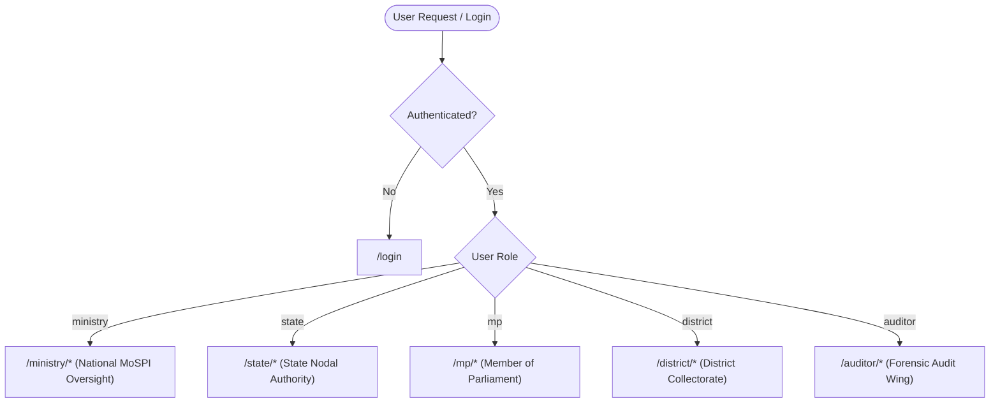

# 🛡️ MPLADS SENTINEL — Frontend Architecture & Component Documentation
### Smart India Hackathon 2026 • AI Anomaly & Early Warning Engine Dashboard

> **MPLADS SENTINEL** is an enterprise-grade AI-powered governance and surveillance dashboard designed for the **Ministry of Statistics and Programme Implementation (MoSPI), Government of India**. It provides automated early-warning risk scoring, forensic audit tracking, vendor collusion detection, and geotagged physical asset verification across 38,000+ Member of Parliament Local Area Development Scheme (MPLADS) infrastructure projects nationwide.

---

## 📑 Table of Contents
1. [Executive Summary & System Objectives](#1-executive-summary--system-objectives)
2. [Technology Stack](#2-technology-stack)
3. [Repository Directory Structure](#3-repository-directory-structure)
4. [Role-Based Access Control (RBAC) & Portals](#4-role-based-access-control-rbac--portals)
   - [Official Demo Credentials](#official-demo-credentials)
5. [Component Architecture & Component Tree](#5-component-architecture--component-tree)
   - [Complete Component Hierarchy](#complete-component-hierarchy)
   - [Layout Layer (5 Role Scaffolds)](#layout-layer-5-role-scaffolds)
   - [Common & Shared UI Components](#common--shared-ui-components)
   - [Modal & Dialog Layer](#modal--dialog-layer)
   - [Dedicated Case Investigation Page (`WorkDetailPage`)](#dedicated-case-investigation-page-workdetailpage)
   - [Global AI Assistant (`ChatbotWidget`)](#global-ai-assistant-chatbotwidget)
6. [Route Map & Page Catalog](#6-route-map--page-catalog)
   - [Route Summary Table](#route-summary-table)
   - [Public Authentication (`LoginPage`)](#-public-authentication)
   - [Ministry Oversight Portal (6 Pages)](#-ministry-oversight-portal-national-view)
   - [State Nodal Authority Portal (2 Pages)](#-state-nodal-authority-portal)
   - [Member of Parliament Portal (3 Pages)](#-member-of-parliament-mp-portal)
   - [District Authority Portal (3 Pages)](#-district-authority-portal-dno--collectorate)
   - [Independent Forensic Auditor Portal (4 Pages)](#-independent-forensic-auditor-portal)
7. [Hybrid Data Layer & State Management](#7-hybrid-data-layer--state-management)
   - [In-Memory Authentication (`AuthContext`)](#in-memory-authentication-authcontext)
   - [Live API Client with Bearer Injection (`apiClient.js`)](#live-api-client-with-bearer-injection-apiclientjs)
   - [Graceful Simulation Fallback Architecture](#graceful-simulation-fallback-architecture)
   - [Live Cross-Dashboard Mutation & Event Sync](#live-cross-dashboard-mutation--event-sync)
8. [Key Innovations & Technical Differentiators](#8-key-innovations--technical-differentiators)
   - [AI Explainability Engine](#1-ai-explainability-engine)
   - [Vendor Cross-Reference Collusion Tool](#2-vendor-cross-reference-collusion-tool)
   - [Predictive Risk Forecasting (30-Day Slippage)](#3-predictive-risk-forecasting-30-day-slippage)
   - [Ground Verification Queue & Photographic Audit](#4-ground-verification-queue--photographic-audit)
9. [Design System & UI Guidelines](#9-design-system--ui-guidelines)
10. [Local Development & Deployment Guide](#10-local-development--deployment-guide)

---

## 1. Executive Summary & System Objectives

The Member of Parliament Local Area Development Scheme (MPLADS) entitles each Member of Parliament (MP) to recommend works of developmental nature with an annual allocation of ₹5 Crore. Operating at this scale across hundreds of constituencies and thousands of implementing agencies creates significant governance hurdles:
- **Cost Inflation**: Tenders bid substantially higher than state schedule of rates (SoR).
- **Milestone Delays**: Stalled works exceeding allowable execution timeframes without timely escalation.
- **Contractor Collusion**: Repeat vendor syndicates, tender splitting below threshold limits, and multi-state contractor cartels.
- **Ghost Assets**: Completed works reported on paper without geotagged ground photograph validation.

**MPLADS SENTINEL** transforms raw administrative registers into actionable intelligence through a high-performance single-page application (SPA) serving 5 levels of administrative hierarchy with sub-second responsiveness.

---

## 2. Technology Stack

| Layer | Technology | Version | Purpose |
| :--- | :--- | :--- | :--- |
| **Core Framework** | React | `^18.3.1` | Declarative UI, Component Composition, Custom Hooks |
| **Build & Bundling** | Vite | `^5.4.2` | Lightning-fast HMR, Rollup production bundling, ESM |
| **Routing** | React Router DOM | `^6.26.2` | Client-side routing, protected layouts, nested outlets |
| **Styling & CSS** | Tailwind CSS | `^3.4.10` | Utility-first design tokens, responsive breakpoints |
| **CSS Utilities** | PostCSS, Autoprefixer | `^8.4.41` | CSS post-processing and vendor prefixing |
| **Class Merging** | `clsx` + `tailwind-merge`| `^2.1.1` / `^2.5.2` | Conditional class composition and deduplication |
| **Icons** | Lucide React | `^0.441.0` | High-fidelity, lightweight SVG iconography |
| **Data Visualization**| Recharts | `^2.12.7` | Composed Bar Charts, Line Charts, Donut/Pie Charts |
| **Custom Graphics** | SVG Vector Engine | Native | Custom Inline Risk Sparklines with pulsing risk emitters |

---

## 3. Repository Directory Structure

```
frontend/
├── index.html                    # Root HTML document with Inter font CDN & metadata
├── package.json                  # NPM dependencies, scripts (dev, build, preview)
├── vite.config.js                # Vite build configuration with React plugin
├── tailwind.config.js            # Custom design tokens, colors, shadows, fonts
├── postcss.config.js             # PostCSS plugins (Tailwind, Autoprefixer)
├── vercel.json                   # Vercel SPA routing rewrite rules
├── .env                          # Local environment variables (VITE_API_URL)
├── .env.production               # Production backend URL configuration
├── dist/                         # Compiled production bundle (generated on build)
└── src/
    ├── main.jsx                  # Application entry point (ReactDOM.createRoot)
    ├── App.jsx                   # Master routing switchboard, RBAC guards, global chatbot
    ├── index.css                 # Global CSS layers, custom scrollbars, transitions
    │
    ├── api/                      # Modular API service abstraction layer
    │   ├── apiClient.js          # Fetch wrapper with auto in-memory Bearer token injection
    │   ├── authApi.js            # Login & /api/auth/me session endpoints
    │   ├── ministryApi.js        # Ministry aggregations & MP utilization rankings
    │   ├── mpApi.js              # MP portfolio endpoints & justification submitter
    │   ├── districtApi.js        # District verification queue & escalation handler
    │   ├── stateApi.js           # State-wide district rollup & drill-down metrics
    │   ├── auditorApi.js         # Forensic queue, vendor profiles & case reporting
    │   ├── chatbotApi.js         # Role-aware NLP query responder & canned domain facts
    │   ├── mpladsService.js      # High-level aggregator for charts & predictive models
    │   ├── mockData.js           # Shared in-memory dataset of 38,000+ simulated works
    │   └── index.js              # Central barrel export for all API modules
    │
    ├── auth/                     # Authentication presets
    │   └── mockAuth.js           # Seeded credentials & quick-login helper profiles
    │
    ├── context/                  # React Context global state management
    │   └── AuthContext.jsx       # In-memory authentication state, token & user session
    │
    ├── components/
    │   ├── layout/               # Role-specific dashboard scaffolding wrappers
    │   │   ├── DashboardLayout.jsx         # Ministry layout (Navbar, Modal, Alert stream)
    │   │   ├── StateDashboardLayout.jsx    # State Nodal Authority layout
    │   │   ├── MpDashboardLayout.jsx       # Member of Parliament layout
    │   │   ├── DistrictDashboardLayout.jsx # District Collectorate layout
    │   │   └── AuditorDashboardLayout.jsx  # Forensic Investigator layout
    │   │
    │   ├── common/               # Universal reusable components
    │   │   ├── TopNavbar.jsx               # Universal adaptive navigation header
    │   │   ├── AlertBellIcon.jsx           # Notification bell with live alert drawer
    │   │   ├── WorkDetailModal.jsx         # Deep-dive inspection modal with explainability
    │   │   ├── DistrictSummaryModal.jsx    # District drill-down modal for State portal
    │   │   ├── MpLeaderboardWidget.jsx     # Top 5 / Bottom 5 utilization widget
    │   │   ├── RiskBadge.jsx               # High/Medium/Low colored status badge
    │   │   ├── Sparkline.jsx               # Inline SVG risk trajectory trend chart
    │   │   ├── FilterBar.jsx               # Multi-dropdown filter bar with reset button
    │   │   ├── SearchBox.jsx               # Search input with instant clear action
    │   │   └── ProtectedRoute.jsx          # Role-based route authorization guard
    │   │
    │   └── ChatbotWidget/        # Persistent AI conversational assistant
    │       ├── ChatbotWidget.jsx           # Floating modal, typing engine & suggestions
    │       └── index.js                    # Chatbot component barrel export
    │
    ├── data/
    │   └── mockMpladsData.js     # Mock reference re-exporter
    │
    └── pages/                    # Route-level view pages
        ├── LoginPage.jsx                   # Universal login + 5 one-click demo logins
        ├── NationalOverviewPage.jsx        # Ministry Command Center overview
        ├── FlaggedCasesPage.jsx            # Filterable register of all anomaly cases
        ├── MpPerformancePage.jsx           # Unbiased MP fund utilization leaderboard
        ├── TrendsAnalyticsPage.jsx         # National macro trends & comparative analytics
        ├── PredictiveForecastPage.jsx      # AI 30-day early warning risk escalation
        ├── WorkDetailPage.jsx              # Dedicated standalone full-page case investigation
        ├── state/
        │   └── StateOverviewPage.jsx       # State-level district rollups (Bihar scope)
        ├── mp/
        │   ├── MpConstituencyOverviewPage.jsx # MP constituency KPI overview
        │   └── MpWorksListPage.jsx         # Full MP recommended works registry
        ├── district/
        │   ├── DistrictOverviewPage.jsx    # District administrative overview
        │   └── DistrictVerificationQueuePage.jsx # Photographic verification & escalation
        └── auditor/
            ├── AuditorCaseQueuePage.jsx    # Forensic high-risk triage queue
            ├── AuditorCaseDetailPage.jsx   # Deep-dive investigation & report filing
            └── AuditorVendorToolPage.jsx   # Contractor collusion & multi-state cross-ref
```

---

## 4. Role-Based Access Control (RBAC) & Portals

The application implements a multi-tenant administrative portal where user role dictates:
1. Permitted routes protected by `<ProtectedRoute allowedRoles={[...]} />`.
2. Navigation links and contextual identity rendered in `TopNavbar`.
3. Read/write operations (e.g., only MP can submit work justifications, only District can mark geotag verified, only Auditor can submit forensic findings).



### Official Demo Credentials
For presentations, evaluations, and hackathon demos, the application supports **both manual password authentication and 1-Click Quick Demo Login** buttons on the login page:

| Role | Role Label | Email | Password | Default Path |
| :--- | :--- | :--- | :--- | :--- |
| **Ministry** | Ministry Admin (National View) | `ministry@mplads.gov.in` | `ministry@mplads123` | `/ministry/overview` |
| **State** | Bihar State Nodal Authority | `bihar@mplads.gov.in` | `bihar@mplads123` | `/state/overview` |
| **MP** | Abhay Kumar Sinha (MP, Aurangabad) | `abhaykumarsinha@mplads.gov.in` | `abhaykumarsinha@mplads123` | `/mp/overview` |
| **District** | Aurangabad District Authority | `aurangabad@mplads.gov.in` | `aurangabad@mplads123` | `/district/overview` |
| **Auditor** | Independent Forensic Investigator | `auditor@mplads.gov.in` | `auditor@mplads123` | `/auditor/queue` |

---

## 5. Component Architecture & Component Tree

### Complete Component Hierarchy

```
<App>
 └── <AuthProvider>
      └── <BrowserRouter>
           ├── <Routes>
           │    ├── <Route path="/login" element={<LoginPage />} />
           │    │
           │    │── /* Ministry Subtree */
           │    ├── <ProtectedRoute allowedRoles={['ministry']}>
           │    │    └── <Route path="/ministry" element={<DashboardLayout />}>
           │    │         ├── <TopNavbar alerts={...} />
           │    │         │    └── <AlertBellIcon />
           │    │         ├── <Outlet /> (Resolves to one of):
           │    │         │    ├── <NationalOverviewPage>
           │    │         │    │    ├── <MpLeaderboardWidget />
           │    │         │    │    ├── <RiskBadge />
           │    │         │    │    └── Recharts (PieChart, BarChart)
           │    │         │    ├── <MpPerformancePage>
           │    │         │    │    ├── <SearchBox />
           │    │         │    │    └── Expandable MP Register Rows
           │    │         │    ├── <FlaggedCasesPage>
           │    │         │    │    ├── <SearchBox />
           │    │         │    │    ├── <FilterBar />
           │    │         │    │    └── <RiskBadge />
           │    │         │    ├── <TrendsAnalyticsPage>
           │    │         │    │    └── Recharts (LineChart, ComposedChart)
           │    │         │    ├── <PredictiveForecastPage>
           │    │         │    │    ├── <FilterBar />
           │    │         │    │    └── <Sparkline />
           │    │         │    └── <WorkDetailPage /> (Dedicated Case View)
           │    │         └── <WorkDetailModal work={selectedWork} />
           │    │
           │    │── /* State Nodal Subtree */
           │    ├── <ProtectedRoute allowedRoles={['state']}>
           │    │    └── <Route path="/state" element={<StateDashboardLayout />}>
           │    │         ├── <TopNavbar role="State Nodal Authority" />
           │    │         ├── <StateOverviewPage>
           │    │         │    ├── <RiskBadge />
           │    │         │    ├── <DistrictSummaryModal />
           │    │         │    └── Recharts (BarChart)
           │    │         └── <WorkDetailPage />
           │    │
           │    │── /* Member of Parliament Subtree */
           │    ├── <ProtectedRoute allowedRoles={['mp']}>
           │    │    └── <Route path="/mp" element={<MpDashboardLayout />}>
           │    │         ├── <TopNavbar role="MP" />
           │    │         ├── <Outlet />:
           │    │         │    ├── <MpConstituencyOverviewPage />
           │    │         │    ├── <MpWorksListPage />
           │    │         │    └── <WorkDetailPage />
           │    │         └── <WorkDetailModal allowJustification={true} />
           │    │
           │    │── /* District Authority Subtree */
           │    ├── <ProtectedRoute allowedRoles={['district']}>
           │    │    └── <Route path="/district" element={<DistrictDashboardLayout />}>
           │    │         ├── <TopNavbar role="District Authority" />
           │    │         ├── <Outlet />:
           │    │         │    ├── <DistrictOverviewPage />
           │    │         │    ├── <DistrictVerificationQueuePage />
           │    │         │    └── <WorkDetailPage />
           │    │
           │    │── /* Independent Auditor Subtree */
           │    ├── <ProtectedRoute allowedRoles={['auditor']}>
           │    │    └── <Route path="/auditor" element={<AuditorDashboardLayout />}>
           │    │         ├── <TopNavbar role="Forensic Auditor" />
           │    │         └── <Outlet />:
           │    │              ├── <AuditorCaseQueuePage />
           │    │              ├── <AuditorCaseDetailPage />
           │    │              ├── <AuditorVendorToolPage />
           │    │              └── <WorkDetailPage />
           │    │
           │    └── <Route path="/cases/:workId" element={<CasesRedirect />} />
           │
           └── <ChatbotWidget /> (Global Floating Assistant)
```

---

### Layout Layer (5 Role Scaffolds)
Each administrative role has its dedicated layout scaffold (`DashboardLayout`, `StateDashboardLayout`, `MpDashboardLayout`, `DistrictDashboardLayout`, `AuditorDashboardLayout`) ensuring:
- Context-specific navigation links and breadcrumbs.
- Role badges, logged-in official profile display, and one-click logout.
- Shared notification bell icon wired to the real-time alert drawer.

---

### Common & Shared UI Components
- **`TopNavbar`**: Adaptive header displaying role title, profile identifier, quick links, and active route highlights.
- **`AlertBellIcon`**: Displays unread anomaly counter badge with slide-out notification drawer.
- **`RiskBadge`**: Consistent, accessible status pills for `High` (Red), `Medium` (Amber), and `Low` (Green) risk states.
- **`Sparkline`**: Lightweight inline SVG line chart rendering risk trends with a pulsating endpoint marker.
- **`FilterBar` & `SearchBox`**: Standardized filtering and search UI with debounce and instant reset buttons.

---

### Modal & Dialog Layer
- **`WorkDetailModal`**: Multi-tab drawer rendering AI explainability score breakdowns, financial disbursement comparisons, photographic proofs, and MP justification forms.
- **`DistrictSummaryModal`**: Drill-down modal for State Nodal officials to inspect individual district performance without page reloads.

---

### Dedicated Case Investigation Page (`WorkDetailPage`)
Accessible at `/:role/cases/:workId` and automatically routed via `/cases/:workId`, this full-page view provides a permanent linkable dossier for formal audits, printable reports, and multi-agency reviews.

---

### Global AI Assistant (`ChatbotWidget`)
Positioned persistently in the bottom-right corner:
- **Role-Aware Context**: Adjusts responses based on whether the logged-in user is a Ministry official, MP, or Auditor.
- **Interactive Suggestions**: Quick prompt buttons for scheme guidelines, anomaly criteria, and expenditure norms.
- **Streaming Response Emulation**: Smooth typewriter animation for chat messages.

---

## 6. Route Map & Page Catalog

### Route Summary Table

| Path | Allowed Roles | Component | Primary Function |
| :--- | :--- | :--- | :--- |
| `/login` | Public | `<LoginPage />` | Email/password login + 5 Quick Demo buttons |
| `/ministry/overview` | `ministry` | `<NationalOverviewPage />` | National KPIs, risk distributions, state summaries |
| `/ministry/mp-performance`| `ministry` | `<MpPerformancePage />` | MP fund utilization leaderboard & rankings |
| `/ministry/flagged` | `ministry` | `<FlaggedCasesPage />` | Filterable nationwide anomaly registry |
| `/ministry/trends` | `ministry` | `<TrendsAnalyticsPage />` | 12-month expenditure timeline & category risks |
| `/ministry/predictions` | `ministry` | `<PredictiveForecastPage />`| 30-day early warning slippage forecasts |
| `/ministry/cases/:workId` | `ministry` | `<WorkDetailPage />` | Standalone case dossier & audit history |
| `/state/overview` | `state` | `<StateOverviewPage />` | State-wide district rollups & drill-down modals |
| `/state/cases/:workId` | `state` | `<WorkDetailPage />` | Standalone case dossier (State view) |
| `/mp/overview` | `mp` | `<MpConstituencyOverviewPage />`| MP entitlement vs expenditure summary |
| `/mp/works` | `mp` | `<MpWorksListPage />` | MP recommended projects registry |
| `/mp/cases/:workId` | `mp` | `<WorkDetailPage />` | Standalone case dossier with justification input |
| `/district/overview` | `district` | `<DistrictOverviewPage />` | Collectorate overview & per-MP breakdowns |
| `/district/verification` | `district` | `<DistrictVerificationQueuePage />`| Ground photographic verification queue |
| `/district/cases/:workId` | `district` | `<WorkDetailPage />` | Standalone case dossier (District view) |
| `/auditor/queue` | `auditor` | `<AuditorCaseQueuePage />` | High-risk triage investigation queue |
| `/auditor/case/:workId` | `auditor` | `<AuditorCaseDetailPage />` | Deep-dive forensic analysis & report filing |
| `/auditor/vendor` | `auditor` | `<AuditorVendorToolPage />` | Multi-state contractor collusion tool |
| `/auditor/cases/:workId` | `auditor` | `<WorkDetailPage />` | Standalone case dossier (Auditor view) |
| `/cases/:workId` | Authenticated | `<CasesRedirect />` | Smart redirect to active role's case route |

---

## 7. Hybrid Data Layer & State Management

### In-Memory Authentication (`AuthContext`)
- Manages `token`, `user`, and `isAuthenticated` state.
- Stores JWT in-memory for security against XSS.
- Automatically passes token to `setAuthToken()` in `apiClient.js`.

### Live API Client with Bearer Injection (`apiClient.js`)
All API calls pass through a unified wrapper:
```javascript
export async function apiFetch(endpoint, options = {}) {
  const url = `${API_BASE_URL}${endpoint}`;
  const headers = {
    'Content-Type': 'application/json',
    ...(inMemoryToken ? { Authorization: `Bearer ${inMemoryToken}` } : {}),
    ...(options.headers || {}),
  };
  const res = await fetch(url, { ...options, headers });
  // Unified error extraction and JSON parsing
}
```

### Graceful Simulation Fallback Architecture
All frontend API modules (`ministryApi.js`, `mpApi.js`, `districtApi.js`, `stateApi.js`, `auditorApi.js`) implement automatic fallback:
1. Attempt `apiFetch()` to the live backend REST server.
2. If backend is offline or network fails, catch gracefully and serve from the local 38,000+ simulation dataset (`mockData.js`).
3. Ensures zero downtime during hackathon stage presentations.

### Live Cross-Dashboard Mutation & Event Sync
State changes (e.g., verifying a ground photo, submitting an MP justification, or filing an auditor report) immediately update in-memory state and trigger UI re-renders across parent components.

---

## 8. Key Innovations & Technical Differentiators

### 1. AI Explainability Engine
Rather than presenting black-box risk scores, `WorkDetailModal` and `AuditorCaseDetailPage` feature a normalized multi-factor breakdown chart:
- **Cost Inflation** ($W_1$): Variance between sanctioned estimate and current expenditure against standard rates.
- **Timeline Slippage** ($W_2$): Delay duration compared to standard construction phase schedules.
- **Duplicate / GIS Proximity** ($W_3$): Spatial clustering detecting duplicate sanctions for identical physical assets.
- **Vendor Concentration** ($W_4$): Monopolization of district works by single entities.

### 2. Vendor Cross-Reference Collusion Tool
Located at `/auditor/vendor`, this tool addresses an endemic public procurement challenge:
- Detects single contractors operating simultaneously under different shell entities across multiple states.
- Identifies **Same-Day Tender Splitting** (multiple contracts awarded just below the ₹10 Lakh statutory competitive bidding threshold).
- Highlights **Repeat Identical Invoices** indicating programmatic billing anomalies.

### 3. Predictive Risk Forecasting (30-Day Slippage)
Located at `/ministry/predictions`, this forward-looking feature isolates projects currently graded as **Low or Medium Risk** that exhibit high *Risk Delta Velocity* ($\Delta R / \Delta t$). By projecting the 30-day escalation curve, authorities can intervene before projects fail.

### 4. Ground Verification Queue & Photographic Audit
Located at `/district/verification`, this feature halts fund release on works marked as "100% Completed" that lack mandatory geotagged physical asset verification photographs, eliminating phantom project fraud.

---

## 9. Design System & UI Guidelines

The UI adheres to a sleek, modern, official design system customized in `tailwind.config.js`:

```
Colors:
├── Background:       #FFFFFF (Crisp white canvas)
├── Card / Table:     #F7F9F9 (Subtle contrast panels)
├── Borders:          #EFF3F4 (Refined 1px dividers)
├── Foreground / Text:#0F1419 (High-contrast charcoal black)
├── Brand Accent:     #1D9BF0 (Indian Gov tech blue, hover: #1A8CD8)
└── Actionable Risk Badges:
    ├── High Risk:    #EF4444 (Rose Red)
    ├── Medium Risk:  #F59E0B (Amber Gold)
    └── Low Risk:     #10B981 (Emerald Green)

Typography:
└── Inter / System UI with monospaced numerics for currency (₹) and Work IDs.

Elevation & Shadows:
├── subtle: 0 1px 3px 0 rgba(0, 0, 0, 0.04)
├── card:   0 1px 4px 0 rgba(15, 20, 25, 0.06)
├── hover:  0 4px 12px 0 rgba(15, 20, 25, 0.08)
└── modal:  0 20px 25px -5px rgba(0, 0, 0, 0.1)
```

---

## 10. Local Development & Deployment Guide

### Prerequisites
- **Node.js**: `v18.0.0` or higher
- **NPM**: `v9.0.0` or higher

### Installation

1. Navigate to the `frontend` directory:
   ```bash
   cd frontend
   ```

2. Install all dependencies:
   ```bash
   npm install
   ```

3. Configure environment variables (optional):
   ```bash
   # .env
   VITE_API_URL=http://localhost:5000
   ```

### Running the Development Server
```bash
npm run dev
```
The application will launch at `http://localhost:5173/`.

### Production Build & Preview
```bash
# Compile optimized production bundle to /dist
npm run build

# Preview the production build locally
npm run preview
```

### Deployment Configuration (`vercel.json`)
The application includes a `vercel.json` file configuring single-page application (SPA) rewrite rules to support client-side deep routing:
```json
{
  "rewrites": [
    { "source": "/(.*)", "destination": "/index.html" }
  ]
}
```

---

*Developed for the **Smart India Hackathon 2026** • Ministry of Statistics and Programme Implementation (MoSPI) Problem Statement.*
